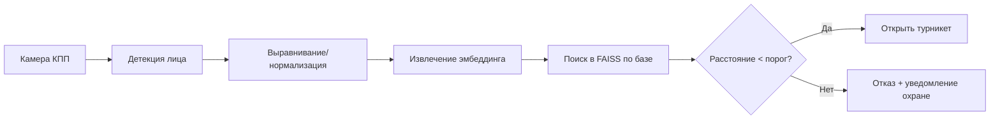
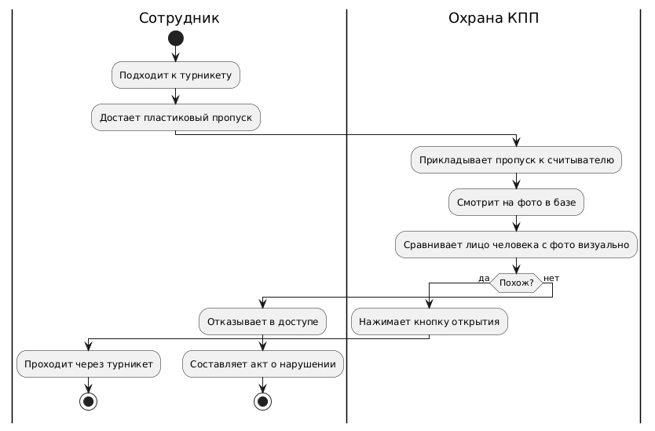
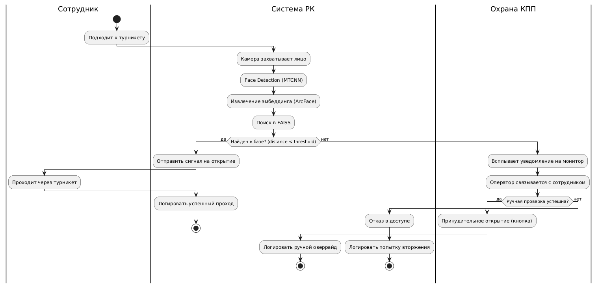
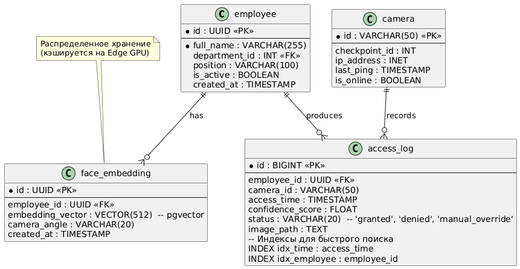
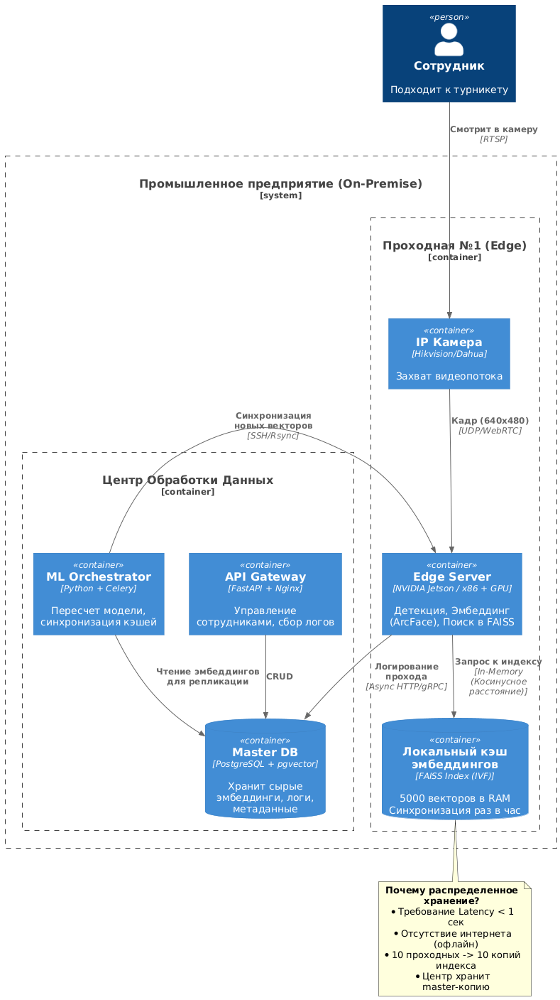
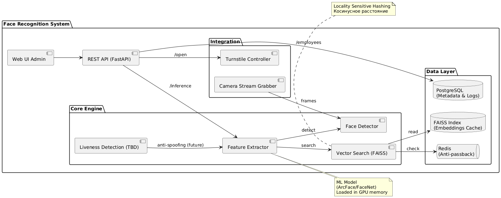
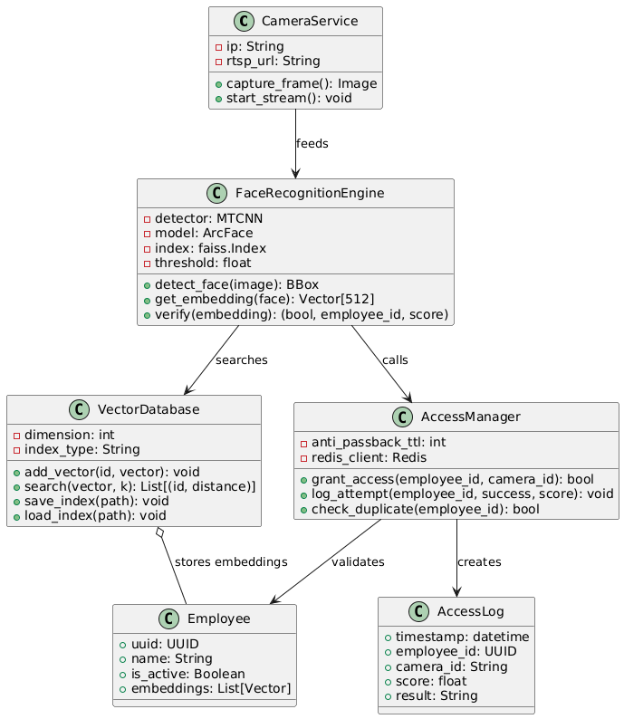
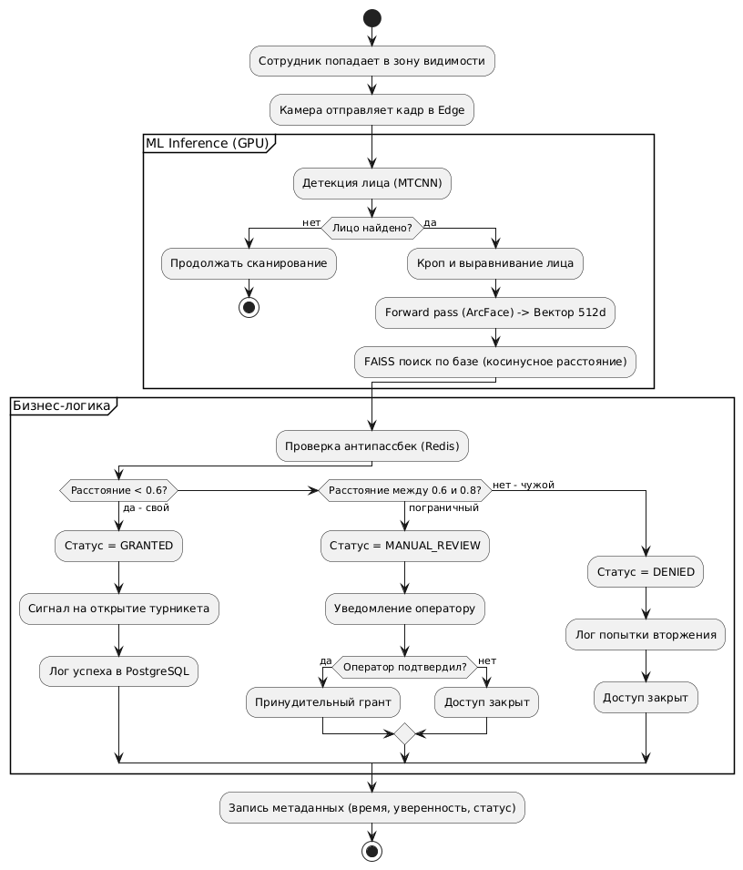
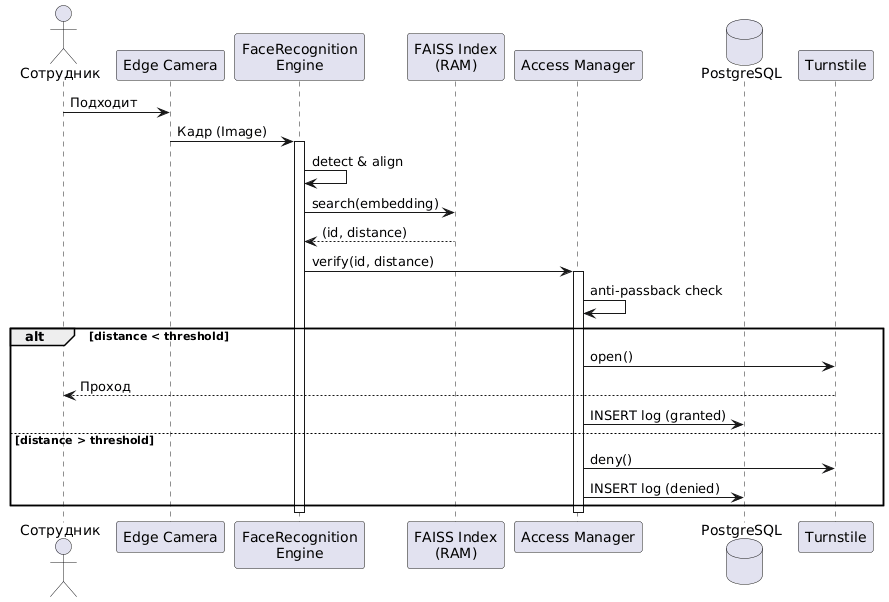

# ML System Design Doc - Идентификация личности по фотографии (Контроль доступа)

## Название кейса
**Автоматизированная система идентификации личности по фотографии для проходной промышленного предприятия**

## Состав команды
| Роль | Имя |
|------|------|
| Product Owner | Москалец Данила Алексеевич |
| Data Architect / Software Architect | Захматов Юрий Дмитриевич |

## Ссылки на диаграммы и модели
| Тип диаграммы | Файл/Ссылка |
|---------------|--------------|
| Модели бизнес-процессов (BPMN/IDEF0) «как есть» и «как будет» | `/diagrams/business_processes.md` или `.png` |
| ER-диаграмма / структура данных | `/diagrams/er_diagram.md` |
| Архитектура системы (распределенное хранение) | `/diagrams/system_architecture.md` |
| UML-диаграмма компонентов / классов | `/diagrams/uml_component_class.md` |
| UML-диаграмма активностей / последовательности | `/diagrams/uml_activity_sequence.md` |

---

## 1. Цели и предпосылки

### 1.1. Зачем идем в разработку продукта?
- **Бизнес-цель (Product Owner)**:  
  Заменить ручную проверку пластиковых пропусков на автоматическую верификацию по лицу на 10 проходных предприятия, сократив время прохода и исключив человеческие ошибки.

- **Почему станет лучше, чем сейчас, от использования ML**:  
  - Исключается возможность пропуска по чужому пропуску.  
  - Скорость идентификации - < 1 секунды вместо 10–15 секунд вручную.  
  - Полная автоматизация логирования проходов.  
  - Снижение нагрузки на службу охраны.

- **Что будем считать успехом итерации (MVP)**:  
  Точность верификации (TPR) ≥ 99% при FAR ≤ 0.1% на тестовой выборке из 5000 сотрудников.

### 1.2. Бизнес-требования и ограничения
- **Бизнес-требования**:  
  - Система должна работать офлайн (без интернета) по соображениям безопасности.  
  - Время идентификации с момента появления лица в кадре до решения - не более 1 секунды.  
  - Интеграция с существующей системой контроля доступа (СКУД).  

- **Ограничения**:  
  - Нет доступа к внешним облачным API распознавания лиц.  
  - Ночная смена, плохое освещение на некоторых КПП.  
  - Сменная работа - возможны незначительные изменения внешности (очки, борода, головной убор).

- **Что ожидаем от конкретной итерации (MVP)**:  
  Рабочий прототип на 1 проходной с базой из 500 сотрудников.

- **Бизнес-процесс пилота**:  
  Сотрудник подходит к турникету → камера захватывает лицо → система сравнивает с БД → если совпадение > порога, турникет открывается, иначе запрос на ручную проверку.

- **Критерии успешного пилота**:  
  Успешный проход в 98% случаев для штатных сотрудников, ложный пропуск постороннего - 0 за 2 недели.

### 1.3. Что входит в скоуп итерации / что не входит (MVP vs технический долг)

| Входит в MVP | Технический долг |
|--------------|------------------|
| Распознавание face‑to‑embedding (FaceNet, ArcFace) | Антиспуфинг (определение фото/маски) |
| База эмбеддингов до 5000 записей | Распределенное хранение эмбеддингов |
| Локальный инференс на GPU (1 КПП) | Горизонтальное масштабирование на 10 КПП |
| Базовое логирование проходов | Репликация БД и failover |

### 1.4. Предпосылки решения
- **Гранулярность**: 1 идентификация на сотрудника за проход.
- **Горизонт**: мгновенный (real-time).
- **Данные**: цветные фото с камеры (640×480 пикселей) + размеченная база сотрудников.
- **Частота пересчета модели**: раз в квартал или при массовом приеме/увольнении.

---

## 2. Методология (Data Scientist)

### 2.1. Постановка задачи с технической точки зрения
- **Тип задачи**: Биометрическая верификация (one‑to‑many) - поиск ближайшего эмбеддинга в базе.
- **Метод**: Сравнение векторов признаков (embedding) через косинусное расстояние.

### 2.2. Блок-схема решения (базовый и MVP)

Полноценная блок-схема с этапами тренировки и инференса - в /diagrams/ml_pipeline.md.

## 2.3. Этапы решения задачи (Data Scientist)

### Этап 1 - Подготовка данных

**Данные и сущности:**

| Название данных | Есть ли в компании (источник) | Требуемый ресурс | Качество проверено |
|----------------|-------------------------------|------------------|--------------------|
| Фото сотрудников (анфас, разные условия освещения) | Частично (база для пропусков, ~5000 фото) | DE, HR, DS | Нет (требуется EDA) |
| Разметка: ID сотрудника + метаданные (подразделение, смена) | Да (HR система) | DE | Да |
| Дополнительные фото (очки, головные уборы, борода) | Нет | Требуется съёмка или синтез | - |
| Фото посторонних для негативного тестирования | Нет | Можно собрать из открытых датасетов (LFW, etc.) | - |

**Результат этапа:**  
Очищенный, размеченный датасет из минимум 1000 уникальных сотрудников (по 5–10 фото на человека) + отдельная выборка для тестирования FAR. Данные разбиты на train/val/test.

---

### Этап 2 - Построение модели (Baseline vs MVP)

| Параметр | Baseline | MVP |
|----------|----------|-----|
| Архитектура для эмбеддингов | MTCNN + FaceNet (pretrained, без дообучения) | FaceNet или ArcFace с fine-tuning на собственных данных |
| Размер эмбеддинга | 512 | 512 |
| Индексация и поиск | Линейный поиск (L2 / косинус) | FAISS (IVF flat) для ускорения |
| Детекция лица | MTCNN | MTCNN + трекинг (упрощённо) |
| Метрики качества | Accuracy, FAR/FRR, ROC-AUC | TPR@FAR=0.1% ≥ 0.99 |

**Целевая переменная:**  
ID сотрудника (задача верификации one-to-many - поиск ближайшего эмбеддинга с порогом).

**Связь метрик с бизнес-результатом:**
- **TPR (True Positive Rate)** - доля своих, которых пустили → удобство сотрудников.
- **FAR (False Acceptance Rate)** - доля чужих, которых пустили → безопасность предприятия.

**Выборка для обучения/валидации:**
- Train: 70% сотрудников, 70% их фото.
- Val: 15% сотрудников, 15% фото.
- Test: 15% сотрудников, 15% фото + отдельно 200 фото посторонних людей.

**Горизонт и частота пересчёта модели:**  
Модель пересчитывается раз в квартал или при массовом изменении состава (>10% сотрудников). Эмбеддинги новых сотрудников вычисляются инкрементально.

**Риски и митигация:**
- *Недостаток данных для некоторых ракурсов* → добавить аугментацию (поворот, яркость, контраст, шум).
- *Модель плохо отличает очень похожих людей* → увеличить порог уверенности + двухфакторная проверка (пин-код для критических зон).
- *Сезонное изменение внешности (шапки, бороды)* → собирать репрезентативные фото в разные сезоны.

**Бизнес-проверка этапа:**  
Демонстрация работы модели на видео с реальных камер проходной (выделенная тестовая смена). Участвует Product Owner и служба безопасности.

---

### Этап 3 - Инференс и интеграция бизнес-правил

**Что делаем:**
- Обёртка модели в REST API (FastAPI/Flask).
- Добавляем бизнес-правила:
  - Если уверенность ниже порога, но выше 0.6 → запрос ручной проверки.
  - Если сотрудник уже прошёл за последние N минут → не пускать повторно (анти-passback).
- Логирование каждого сравнения (ID камеры, timestamp, результат, уверенность).

**Результат этапа:**  
API-сервис, который по POST-запросу с изображением возвращает `{granted: bool, user_id: str, confidence: float}`.

---

## 3. Подготовка пилота

### 3.1. Способ оценки пилота

Пилот запускается на **одной проходной** (наиболее загруженной).  
- **Контрольная группа (A)**: существующий ручной процесс (пропуск + визуальная проверка).  
- **Экспериментальная группа (B)**: ML-система.  
- Распределение по дням (неделя A, неделя B) или по часам (чётные/нечётные часы).  
- Резервный оператор наблюдает за ML-системой и может вмешаться.

### 3.2. Что считаем успешным пилотом

| Метрика | Целевое значение |
|---------|------------------|
| TPR (свои пропущены) | ≥ 98% |
| FAR (чужие пропущены) | 0 за 2 недели |
| Время идентификации (p95) | ≤ 1 секунда |
| Доля ручных вмешательств оператора | ≤ 5% от всех попыток |

### 3.3. Подготовка пилота

**Вычислительные ресурсы:**  
- Один сервер с GPU NVIDIA T4 (или аналогичный) на КПП.  
- Ожидаемая нагрузка: до 10 человек/мин в часы пик.  
- Инференс одного кадра: ~30 мс (детекция + эмбеддинг + поиск).  

**Этапы подготовки:**
1. Установить камеру и Edge-сервер.
2. Загрузить эмбеддинги всех сотрудников предприятия (5000 чел).
3. Провести сухое тестирование (сотрудники по очереди подходят добровольно).
4. Переключить один турникет на ML-режим.

---

## 4. Внедрение (production-система)

### 4.1. Архитектура решения

*См. детальную диаграмму в `/diagrams/system_architecture.md`.*  

Основные компоненты:
- **Камера** (IP, H.264) → поток в Edge-сервер.
- **Edge-сервер** (NVIDIA Jetson или x86+GPU):
  - Детекция и трекинг лиц.
  - Извлечение эмбеддинга.
  - Запрос к индексу FAISS.
- **Центральный сервер**:
  - PostgreSQL для логов и метаданных.
  - Redis для кэша недавних проходов (anti-passback).
- **API** (REST) для управления базой сотрудников и получения логов.

### 4.2. Инфраструктура и масштабируемость

**Выбор:** on-premise, потому что:
- Запрещён выход в интернет (безопасность).
- Низкая латентность (<1 с) требует локального GPU.

**Масштабирование:**
- Каждая проходная получает свой Edge-сервер.
- Центральный сервер один на все 10 КПП.
- При росте до 20 КПП - репликация БД и балансировка записи логов.

**Плюсы:** полный контроль, отсутствие зависимости от внешних сетей.  
**Минусы:** сложность обновления модели на всех Edge-серверах (нужен CI/CD пайплайн).

### 4.3. Требования к работе системы

| Параметр | Значение |
|----------|----------|
| SLA | 99,9% (допустим простой не более 8 часов в год) |
| RPS (пиковый) | 5 запросов/сек |
| Latency p99 | 1000 мс |
| Время восстановления (RTO) | 15 минут |

### 4.4. Безопасность системы

**Потенциальные уязвимости:**
- Подстановка распечатанного фото или видео на телефоне.
- Атака повторного прохода (replay) - уже учтено анти-passback.

**Планы защиты:**
- Liveness detection (технический долг на следующую итерацию) - анализ микродвижений, бликов.
- В критических зонах (серверная, склад ценностей) - комбинация лицо + пин-код.

### 4.5. Безопасность данных

- Эмбеддинги лица не являются биометрическими сырыми данными (нельзя восстановить фото), но GDPR рассматривает их как персональные.  
- Все данные хранятся в локальной сети, никакой передачи вовне.  
- Доступ к логам только у службы безопасности и DBA.  
- Регулярное удаление логов старше 1 месяца.

### 4.6. Integration points

- **СКУД**: API `/access/grant` (открыть турникет) через локальный Modbus/Relay.
- **Кадровая система**: ежедневная выгрузка списка активных сотрудников (для обновления базы эмбеддингов).
- **Мониторинг**: Prometheus + Grafana (метрики: latency, FAR/TPR, загрузка GPU).

### 4.7. Риски

| Риск | Вероятность | План смягчения |
|------|-------------|----------------|
| Отказ GPU на Edge-сервере | Низкая | Резервный CPU-режим (медленнее, но работает) |
| Сильное изменение освещения (зима/лето) | Средняя | Периодическое дообучение на новых данных с камер |
| Массовый приём/увольнение (авито) | Средняя | Автоматическая генерация эмбеддингов для новых сотрудников (при приёме фотографируются) |
| Человеческий фактор (оператор отключает систему) | Низкая | Логирование действий + алерт при отключении |

---

## 5. Приложение: ссылки на файлы с диаграммами

### 5.1. Бизнес-процесс «как есть» (ручной КПП)

### 5.2. Бизнес-процесс «как будет» (ML-КПП)

### 5.3. ER-диаграмма базы сотрудников и логов

### 5.4. Архитектура системы (распределённое хранение эмбеддингов) — C4

### 5.5. UML-диаграмма компонентов

### 5.6. UML-диаграмма классов

### 5.7. UML-диаграмма активностей (сценарий прохода)

### 5.8. UML-диаграмма последовательности (взаимодействие компонентов)

